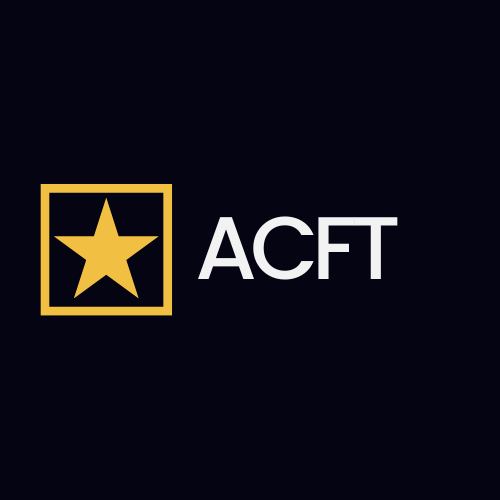
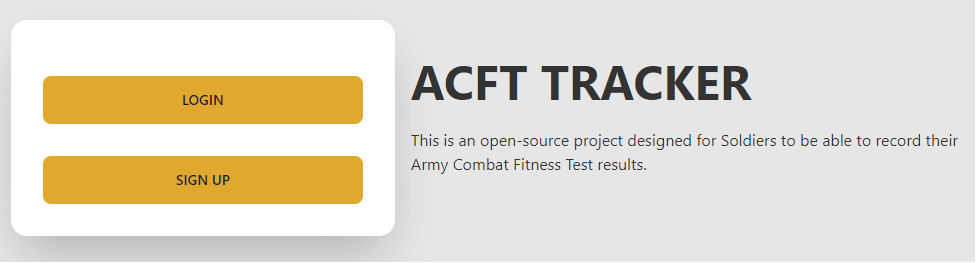

<a id='readme-top'> </a>

<br />
<div align="center">
  <a href="https://github.com/redconOne/acft">
    
  </a>
  <h3 align="center">
    Army Combat Fitness Test Tracker
  </h3>
  <p align="center"> 
    A way to score and record your results from a US Army Physical Fitness Test
    <br />
    <a href="https://github.com/redconOne/acft"><strong>Explore the docs »</strong></a>
    <br />
    <br />
    <a href="https://acft-production.up.railway.app/">View Live</a>
    |
    <a href="https://github.com/redconOne/acft/issues">Report Bug</a>
    |
    <a href="https://github.com/redconOne/acft/issues">Request Feature</a>
  </p>
</div>

<details>
  <summary>Table of Contents</summary>
  <ol>
    <li>
      <a href="#about">About</a>
      <ul>
        <li>
          <a href="#built-with">Built With</a>
        </li>
      </ul>
    </li>
    <li>
      <a href="#getting-started">Getting Started</a>
      <ul>
        <li>
          <a href="#prerequisites">Prerequisites</a>
        </li>
        <li>
          <a href="#installation">Installation</a>
        </li>
      </ul>
    </li>
    <li>
      <a href="#usage">Usage</a>
    </li>
    <li>
      <a href="#roadmap">Roadmap</a>
    </li>
    <li>
      <a href="#optimizations">Optimizations</a>
    </li>
    <li>
      <a href="#lessons-learned">Lessons Learned</a>
    </li>
    <li>
      <a href="#contributing">Contributing</a>
    </li>
    <li>
      <a href="#license">License</a>
    </li>
    <li>
      <a href="#contact">Contact</a>
    </li>
  </ol>
</details>

## About

<div align="center">
  
</div>

<br />
<p>
  ACFT Trainer is a way for US Soldiers to score their tests and record the results. Results can be reviewed and edited later, and scoring is calculated live. 
</p>

### Built With


<p align="right">
  (<a href="#readme-top">back to top</a>)
</p>

## Getting Started

<p>
  To get the project running on your local machine you will require Node.js and to use the following instructions.
</p>

### Prerequisites


```sh
npm install npm@latest -g
```

### Installation

1. Sign up for your own non-relational document database at
   [https://www.mongodb.com/](MongoDB)
2. Clone the repo
   ```sh
   git clone https://github.com/redconOne/acft.git
   ```
3. Install NPM packages
   ```sh
   npm install
   ```
4. Enter your port, database string, and API keys in `config.js` or `.env` file
   ```sh
    PORT = 2121 (or port of your choosing)
    DB_STRING = `your database URI`
   ```
5. Run in development environment
   ```sh
   npm start
   ```

## Usage

- Sign up to get started.
- Start by selecting your identifying information
- Input test results for scoring

<p align="right">(<a href="#readme-top">back to top</a>)</p>

<!-- ROADMAP -->

## Roadmap

- [x] Include a modal with exercise description
- [ ] Further refine Records page
- [ ] Add settings
  - [ ] Save settings for next session

See the [open issues](https://github.com/redconOne/acft/issues) for a full list
of proposed features (and known issues).

<p align="right">(<a href="#readme-top">back to top</a>)</p>

## Optimizations

An update/refactoring of the Records page is currently in development, as well
as a Settings page to adjust User Settings (like light/dark themes). Planned
future optimizations include ongoing improvements to the user interface and
navigation.

## Lessons Learned

I knew I wanted to incorporate an MVC structure to maintain organization during
development but also to allow future improvements and features to be implemented
post-production of ACFT. New features can easily be worked into a new or
exisiting model, followed by logic and data retrieval within the controllers to
then routing and paths be configured accordingly.

It was important to me to have a robust code base that would fascilitate
incorporating new features, but also modularity so that the views could be
swapped out to integrate a different front-end library, like React.
TailwindCSS + DaisyUI combination offered components and additional UI support I
had envisioned for a clean aesthetic and user friendly experience as part of the
project's core features.

A good portion involved using package libraries' respective documentation to
troubleshoot issues encountered along the way.

<!-- CONTRIBUTING -->

## Contributing

Feel free to join in! Whether its fixing bugs, improving documentation, or
simply spreading the word! Please see
[Contributing Guidelines](/CONTRIBUTING.md) for further guidance. If you require
assistance please don't hesitate to reach out! P.S. Don't forget give the
project a star!

<!-- LICENSE -->

## License

Distributed under the MIT License. See [LICENSE](./LICENSE) for more
information.

<!-- CONTACT -->

## Contact

<h3 align='center'> Ming Ng</h3>
<h4 align='center'>
  <a href="https://twitter.com/MingLeeNg1">Twitter</a> |
  <a href="https://linkedin.com/in/MingLeeNg">Linkedin</a>
</h4>

Project Link: [ACFT](https://acft-production.up.railway.app/)

<p align="right">(<a href="#readme-top">back to top</a>)</p>
